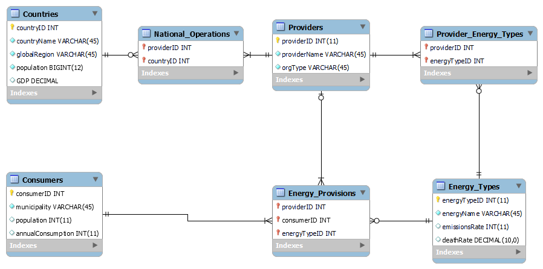
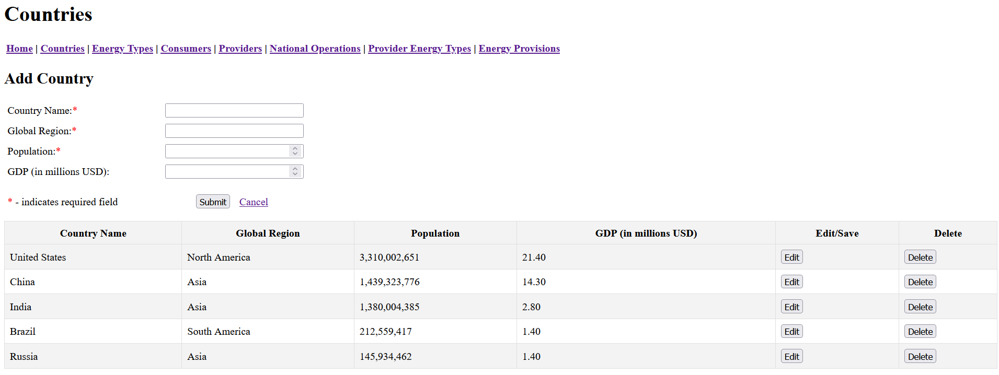

# GEAD: Global Energy Accessibility Database

GEAD is a Flask full-stack web app to manage a MySQL/MariaDB database tracking the relationships between energy providers and municipal consumers in different countries.

## Usage
- In a Python virtual environment, execute `pip install requirements.txt`

- In your database management tool of choice
    - Create a new database
    - Execute `database/GEAD_DDL.sql` to create the tables
    - Optionally, execute `database/SAMPLE_DATA.sql` to insert sample entries
- Create a `site/.env` file containing the following parameters
    - `DBHOST`  - host of MySQL/MariaDB database
    - `DBUSER`  - database username
    - `DBPW`    - user password
    - `DB`      - name of database
    - `PORT`    - port number to run app on
- Execute `app.py`

## Database Schema

### `National_Operations` - M:N Intersection Table
Records the present operation of a specific provider in a specific country.
- `Countries` can contain multiple `Providers`
- `Providers` can operate in multiple `Countries`

### `Provider_Energy_Types` - M:N Intersection Table
Records a type of energy generated by the provider.
- `Providers` can offer multiple `Energy_Types`
- `Energy_Types` can be offered by multiple `Providers`

### `Energy_Provisions` - M:N:N Intersection Table
Records the ongoing provision of an energy type from a provider to a consumers.
- `Providers` can provide multiple `Energy_Types` to multiple `Consumers`
- `Consumers` can receive multiple `Energy_Types` from multiple `Providers`

## Interface

Each table has an HTML interface featuring CRUD operations to **Read** the table, **Create** new entries, and **Update** and **Delete** entries inline. 

- Where null values are allowed, they may be entered by inputting "null" (case-insensitive), or leaving the field blank. 
- Deletion of rows from any of these tables deletes all M:N entries which reference them, save for the `Countries` table delete operation, which updates `National_Operations` references to deleted countries to NULL.